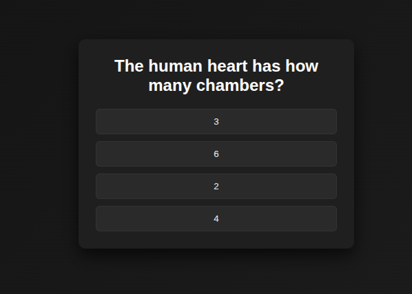
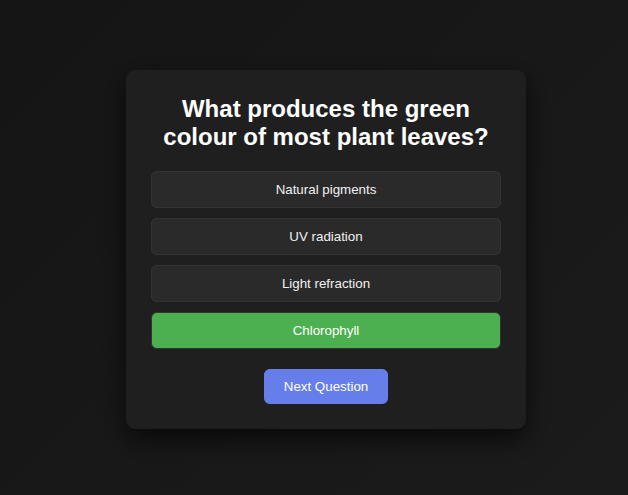
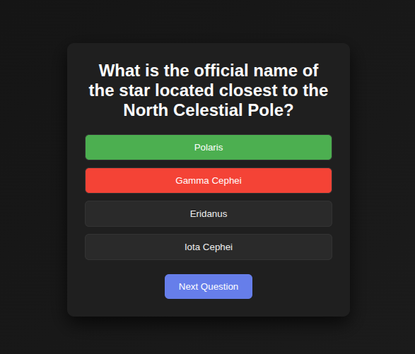
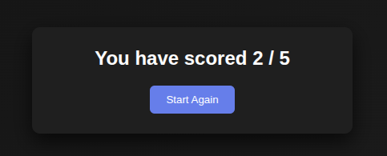

# Quiz App

An interactive and responsive **Quiz Application** built using **HTML, CSS, and JavaScript**.  
The app fetches real-time multiple-choice questions from a public trivia API, provides instant answer feedback, and tracks the user's score.

---

##  Features

- 🎯 Dynamic quiz questions loaded from an external API  
- ✅ Instant feedback (correct answers turn green, wrong turn red)  
- ➡️ Smooth question navigation  
- 🧮 Final score display after quiz completion  
- 🔁 Restart quiz with new questions  
- ⏳ Loading indicator while fetching data  
- 🌙 Modern dark-themed UI  
- 📱 Fully responsive for mobile and desktop

---

##  Tech Stack

- **HTML** – Structure  
- **CSS** – Styling and responsive layout  
- **JavaScript** – Quiz logic, API calls, DOM manipulation  

---

## 📸 Screenshots

### Question Screen

### Correct Answer Feedback

### Wrong Answer Feedback

### Final Score Screen

---

## 🎮 How It Works

1. App loads and fetches quiz questions from an API  
2. User selects one of four options  
3. App highlights correct and incorrect answers  
4. User proceeds through all questions  
5. Final score is displayed  
6. User can restart and attempt a new quiz

---

## 📌 Learning Outcomes

This project helped practice:

- Working with APIs and asynchronous JavaScript  
- DOM manipulation and event handling  
- Managing application state (score, questions, progress)  
- Building responsive user interfaces  

---

## 🌐 Live Demo

👉 [Click here to try the Quiz App] https://subhajitcodes.github.io/quiz-app/

---

